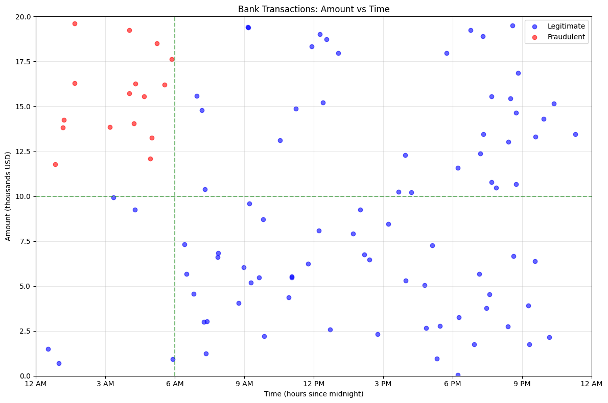
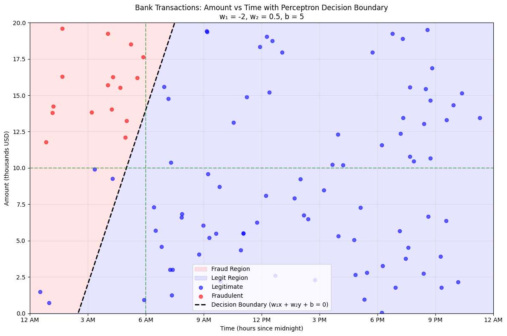

# Perceptron

## History

The disruption caused by LLMs (Large Language Models) might seem to have come out of nowhere, but the core building block can be traced all the way back to 1957, when the perceptron was first conceived by Frank Rosenblatt. He thought of the perceptron as a computational representation of a neuron as found in the human brain. Initially, the perceptron was implemented as a hardware machine, as opposed to a general algorithm which we're going to discuss here.

And thus, it is safe to say that the idea has been around for a long time, but if that's the case, why has the GenAI revolution only started recently? And what exactly is a perceptron, what has it to do with GenAI, and what can it be used for?

## Overview
### Making decisions: to walk or not to walk

Imagine you're deciding whether to go for a walk or not. Your willingness to go depends on two factors:
1. The weather is good
2. You have time 

We can decide to represent these two statements with two variables, $x_{weather}$ and $x_{time}$. Whether this statement is true or not, we can represent using a **binary encoding**, which is just a fancy way of saying that we use 0 and 1 to represent the truthfulness of a statement. In general, we use 1 to represent that something is true, while we use 0 to represent false:

<div align="center">

| Expression | Encoding |
| --- | --- |
|The weather is good | $x_{weather} = 1$ |
| The weather is NOT good | $x_{weather} = 0$ |
| You have time | $x_{time} = 1$ |
| You do NOT have time | $x_{time} = 0$ |

</div>

So if $x_{weather} = 1$, then that means that the weather is good. If $x_{weather} = 0$, then the weather is not good. 

Since your willingness to go for a walk depends on these two statements we can define the following equation: 

<div align="center">

$y_{willingness} = f(x_{weather}, x_{time})$,

</div>

with $f$ representing a function that we don't know yet. To explain it in natural language, we define our **output** $y_{willingness}$ as a function that takes $x_{weather}$ and $x_{time}$ as **inputs**.

This is an important observation: any AI model, in any shape or form, takes one or more inputs and produces one or more outputs (usually indicated by $x$ and $y$ respectively).

Suppose now that the previously unknown function is simply the sum, the equation then becomes very simple: 

<div align="center">

$$y_{willingness} = x_{weather} + x_{time}$$

</div>

By varying our inputs, we can get different values for our output:

<div align="center">

$x_{weather}$ | $x_{time}$ | $y_{willingness}$ 
--- | --- | ---
0 | 0 | 0
0 | 1 | 1
1 | 0 | 1
1 | 1 | 2

</div>

Notice that there are three possible values for $y_{willingness}$: 0, 1, and 2. In order to interpret these values, we need to take a step back, and ask ourselves the following question: *when do we want to go for a walk?* Suppose that you want to go for a walk only if the weather is both good and you have time. In this case your willingness to go for a walk is the highest it can be. This translates to the last row in the table above, when $y_{willingness} = 2$. If the weather is good, but you have no time, or if you have time, but the weather is not good, you do not want to go for a walk. This corresponds to row two and three, when $y_{willingness} = 1$. Evidently, if the weather is not good and you don't have time to go for a walk, then you don't want go for a walk. We summarize:


<div align="center">

$y_{willingness}$ | Go for a walk?
--- | --- 
0 | No 
1 | No
2 | Yes

</div>

Remember the binary encoding for the inputs? A similar encoding can be made for whether to go for a walk:

<div align="center">

Expression | Encoding
--- | ---
You go for a walk | $y_{walk} = 1$
You do not go for a walk | $y_{walk} = 0$

</div>

Unfortunately, we only have two values here, as opposed to the previously resulted three, so we cannot directly map $y_{willingness}$ to $y_{walk}$. It seems that simply taking the sum will not get us to where we need be. So, we add a very small change: we define the **Heaviside step function**. 

The Heaviside step function acts like a threshold or decision boundary. In our case, the meaning would be 'if our willingness reaches or exceeds 2, we'll go for a walk; otherwise, we won't'. This concept of having a threshold that determines the final yes/no decision is fundamental to how the perceptron works.

In mathmetical notation, we define the heaviside step function as:

TODO
<div align="center">

$H(x) = \begin{cases} 1, & x \leq 2 \\ 0, & x < 2 \end{cases}$

</div>

In natural langauge: the heaviside step function maps an input value to either 0 or 1. In our case we place the threshold at 2, meaning that any value below 2 will be mapped to 0, while any value larger or equal to 2 will be mapped to 1.

We summarize everything up till now:

<div align="center">

Good Weather? | Free time? | $x_{weather}$ | $x_{time}$ | $y_{willingness}$ | $y_{walk}$
--- | --- | --- | --- | --- | ---
No | No | 0 | 0 | 0 | 0
No | Yes | 0 | 1 | 1 | 0
Yes | No | 1 | 0 | 1 | 0
Yes | Yes | 1 | 1 | 2 | 1

</div>

And we're done! To recap, we took the following steps:
1. We encoded the inputs as 0 or 1 to represent whether the weather was good and if you have free time
2. We took the sum of the inputs to represent our willingness to go for a walk
3. We mapped the resulting sum to 0 or 1 that indicates if we're actually going for a walk

### Taking into account importance

Now suppose that you attach more importance to one of the two conditions, i.e., you still want to go for a walk if the weather is good, even though you don't have the time to do so. This cannot be represented in the model above. Suppose you would create an updated decision table:

<div align="center">

$y_{willingness}$ | Go for a walk?
--- | --- 
0 | No 
1 | Yes
2 | Yes

</div>

Indeed, this updated table will indicate that we want to go for a walk if the weather is good, despite not having the time. However, this has an unintended consequence: according to the table, you will also go for a walk if you have time but the weather is not good. It becomes clear once we write out the entire table:

<div align="center">

Good Weather? | Free time? | $x_{weather}$ | $x_{time}$ | $y_{willingness}$ | $y_{walk}$
--- | --- | --- | --- | --- | ---
No | No | 0 | 0 | 0 | 0
No | Yes | 0 | 1 | 1 | **1**
Yes | No | 1 | 0 | 1 | **1**
Yes | Yes | 1 | 1 | 2 | 1

</div>

Now this is an issue, because maybe the weather being good is very important to you, and you don't want to go for a walk if you have time but the weather is not good. Suppose we represent the importance of having free time as 1, then the importance of the weather being good is higher, let's say 2. These values are called **weights**. They represent to what extend an input is important to take into account when deciding on your output. The weights (importance) can be represented as follows $w_{weather} = 2$ and $w_{time} = 1$.

Now, let's recall what we did before to get to our decision (output value): we took the sum of the different inputs, and put it through a function that mapped the sum to 0 or 1. Including weights in this process is actually relatively simple: instead of taking the normal sum, we take the **weighted sum**, which is simply the sum of the inputs multiplied by their importance:

<div align="center">

$y_{willingness} = w_{weather}x_{weather} + w_{time}x_{time} = 2\times x_{weather} + 1\times x_{time}$

</div>

Using this newly obtained formula we can update the tables:

<div align="center">

Good Weather? | Free time? | $x_{weather}$ | $x_{time}$ | $y_{willingness}$ 
--- | --- | --- | --- | --- 
No | No | 0 | 0 | 0 
No | Yes | 0 | 1 | 1
Yes | No | 1 | 0 | 2 ($= 2\times1 + 1\times0$)
Yes | Yes | 1 | 1 | 3 ($= 2\times1 + 1\times1$)

</div>

But, now we have increased the number of possible values for $y_{willingness}$, so how can we map them to 0 and 1? Turns out we don't need to change anything. Recall from before: every value below 2 gets mapped to 0, and every value above or equal to 2 gets mapped to 1. This results in the following table:

<div align="center">

Good Weather? | Free time? | $x_{weather}$ | $x_{time}$ | $y_{willingness}$ | $y_{walk}$
--- | --- | --- | --- | --- | ---
No | No | 0 | 0 | 0 | 0
No | Yes | 0 | 1 | 1 | **0**
Yes | No | 1 | 0 | 2 | **1**
Yes | Yes | 1 | 1 | 3 | 1

</div>

And voila, we have what we wanted to achieve! 

Before we move on, let's understand why we need one more piece to complete our puzzle. So far, we've been using 2 as our decision boundary - if our weighted sum is 2 or greater, we go for a walk. But mathematically, it's more elegant to use 0 as our decision boundary. This is where the **bias** comes in - it helps us shift our decision boundary to 0, making our perceptron more mathematically standard.

Indeed, the Heaviside step function actually uses 0 as the decision boundary, meaning that it maps any value smaller than 0 to 0 and any value larger or equal to 0 to 1: 

TODO
$$
H(x) := \begin{cases}
1, & x \leq 0 \\
0, & x < 0
\end{cases}
$$

Fortunately, the perceptron has, besides its inputs, the **bias** to deal with this exact issue. The bias is taken into account in the weighted sum and decides our decision boundary. We update the weighted sum equation: 

<div align="center">

$y_{willingness} = w_{weather}*x_{weather} + w_{time}*x_{time} + b,$

</div>

with $b$ the bias.

We can find $b$ by taking a close look at this equation. We now that $y_{willingness} = 0$ is the boundary, so we can work out the following:

<div align="center">

$2\times x_{weather} + x_{time} + b = 0$

</div>

The minimum for us to go on a walk is $x_{weather} = 1$ and $x_{time} = 0$:

<div align="center">

$2 + 0 + b = 0$
</div>

<div align="center">

$b = -2$

</div>

We fill in the equation to show that it is indeed the same, the formula becomes:

<div align="center">

$y_{willingness} = 2\times x_{weather} + x_{time} - 2$

</div>

Let's consider our table again:

<div align="center">

Good Weather? | Free time? | $x_{weather}$ | $x_{time}$ | $y_{willingness}$ | $y_{walk}$ 
--- | --- | --- | --- | --- | ---
No | No | 0 | 0 | -2 ($= 0+0-2$) | 0
No | Yes | 0 | 1 | -1 ($= 0+1-2$) | 0 
Yes | No | 1 | 0 | 0 ($= 2+0-2$) | 1
Yes | Yes | 1 | 1 | 1 ($= 2+1-2$) | 1

</div>

Although, we get different values for $y_{willingness}$ now, the corresponding $y_{walk}$ stays the same, since we shifted the threshold.

What we've just walked through is a process called **inference** - the process where a perceptron (or a model in general) takes inputs and produces a decision. 

Let's break down what inference looks like for a perceptron:
1. The perceptron receives input values (in our case, whether it's good weather and if we have time)
2. It multiplies each input by its corresponding weight (showing how important each factor is)
3. It adds the bias (shifting our decision boundary)
4. Finally, it uses the Heaviside step function to make a yes/no decision

Congratulations, you now understand the steps a perceptron goes through to make decisions! It can make binary decisions, given a few facts and taking into account the importance. This is what makes the perceptron so interesting: it is a one of the simplest forms of artificial intelligence.

Figure 1 provides a visual representation of this process, showing how all these components work together. On the left you can see three inputs in green, on their edges towards the orange circle, they have their weight listed. The orangle circle contains the summation symbol, meaning that we perform the sum of all the inputs, being the weighted inputs and the bias term. After that, in the orange square we apply the Heaviside step function, which gives us our output, $y$.

<div align="center">


*Diagram of the perceptron*

</div>

### Learning from your mistakes

Up until now, our perceptron has been using weights and bias values that we provided. But in real-world applications, we rarely know the perfect values for these parameters. This is where the true power of the perceptron comes in: its ability to learn from examples, a process we call **training**. This might seem a little daunting (and I will spare you the technical details), but it turns out, this part too is actually quite intuitive. To show this, let's illustrate this by taking the previous example. 

Now suppose that your friend somehow convinced you to go on a walk even though the weather was not that nice. And, despite your unwillingness to go, suprisingly enough, you very much enjoyed the walk. This is a new experience for you and you decide to reflect about your previous decision making: it's time for learning. You realise that in the past you might've attached too much importance on the weather aspect during your decision making, because, as it turns out, walks can still be very enjoyable despite bad weather! 

Let's consider one more example, imagine you're going on a walk because the weather is nice, despite having no time to do so since you still have a lot of other chores you need to do at home. You very much enjoy the walk, but afterwards do not have the time to fullfill your chores which stressed you out. And once again you reflect, maybe having free time should be more important?

Both of these examples show how an experience can influence the way you reason about your surroundings and your decision making. Next time, your willingness to go for a walk might be lower if you don't have free time: it becomes a more important requirement. Looking back at our perceptron, we realise we already have a way of indicating our importance: the weights.

And there you have it, this is exactly what the training of a perceptron entails: based on new experiences, we update the parameters of the models, to better reflect the new reality. When we talk about parameters in a perceptron, we mean the weights and bias - these are the values that the perceptron can adjust during training to improve its decision-making. Think of them as the "knobs" that the perceptron can turn to get better at its task.

So when training the perceptron, we provide it with combinations of inputs and the resulting decision that the perceptron should make. The perceptron will slowly adjust its weights and bias in such a way that it is best able to make these decisions. After the model has been trained, we can use it for inference by only providing inputs to the perceptron; the perceptron will decide on the result. To summarize the difference between training and inference:

<div align="center">

Task | Description | Required Input | Output
--- | --- | --- | ---
Training | The model learns from examples by adjusting its weights and bias | Both inputs AND correct answers | Updated parameters (weights and bias)
Inference | The model makes decisions using learned parameters | Only inputs | Predicted answer
    
</div>

### Visualization

Let's take a look at a somewhat more complex example now: suppose we want to detect whether a bank transfer is fraudulent or legit. This is a binary classification problem: a transfer is either fraudulent or it is not. There are no other options, there is no grey zone, and a transfer cannot be a "little" fraudulent. And so, it seems that we can use the perceptron to classify each transfer into one of the two categories.

Now, suppose that there are two factors that contribute to whether a transfer is fraudulent: the amount that has been transferred and the time the transfer was initiated. Of course, this is as strong of an over-simplification that can be made, but it will suffice for now. Let's now make an even stronger assumption, namely that a transfer is fraudulent if and only if it was done both late at night, (e.g., between 12 and 6 AM) and if the amount transferred is for an amount bigger then 10,000 USD. The following table shows a few examples:

<div align="center">

Example | Time | Amount (USD) | Meets Time Condition? | Meets Amount Condition? | Fraudulent?
--- | --- | --- | --- | --- | ---
1 | 8 PM | 325 | No | No | No
2 | 5 AM | 3,485 | Yes | No | No
3 | 1 PM | 10,329 | No | Yes | No
4 | 3 AM | 11,399 | Yes | Yes | Yes

</div>

Only the fourth transfer is fraudulent, since it is done at 3 AM and it is an amount of more than 10,000 USD. The other three either only satsify one of the conditions, or none.

Let's now see how the perceptron behaves using a visual approach. Consider Figure 2. It shows legitimate and fraudulent transfers, plotted out in a graph: on the x-axis we find the time of execution, on the y-axis we put the amount of money transfered. The fraudulent transfers are indicated in red, while the legitimate are indicated in blue. We add green dotted lines to show the area of fraudulent transfers.

<div align="center">


*Different datapoints plotted as a scatterplot*

</div>

Now try drawing a single straight line to split the plot into two areas: one where all the red dots lie, and one where all the blue dots can be found. You will find that it is impossible, so at least try to limit the amount of wrongly placed dots (blue dots on the side of reds, or red dots on the side of blues).

This is exactly what the perceptron tries to do as well: it tries to find the linear function that best divides the datapoints into two categories, such that the amounts of misclassifications is minimized. Furthermore, the fact that you're unable to draw a single straight line that will classify all of the samples correctly shows a very important caveat for AI models (so not just perceptron): in real life scenarios, it is extremely difficult, often impossible to create a model that is always correct.

You might wonder how the perceptron is trying to place a straight line. If you've read the first section, recall the weighted sum of before: it turns out that the weighted sum actually defines a straight line:

<div align="center">

$w_{amount}x_{amount} + w_{time}x_{time} + b = 0$

</div>

If you don't immediately find how this defines a function, it's worth transforming it in a way that may be more familiar:

<div align="center">

$x_{amount} = \frac{-w_{time}x_{time} - b}{w_{amount}}$

</div>

Which might remind you of $y = f(x)$ which is indeed a way to represent a function. Since $f(x)$ is linear, it defines a straight line.


The approach the perceptron takes to find the (or 'a', if multiple solutions can be found) function that best classifies the data is quite simple. First, start with a randomly generated line. After that, the goal is to update the parameters of this line to achieve better performance.

But what does it mean to have better performance? To measure the quality of a model, we use **metrics**. Metrics are dependent on what the use-case is of the model, but in this case we can keep it very simple: 

<div align="center">

$Accuracy = \frac{Correctly\ Classified\ Datapoints}{Total\ Number\ of\ Datapoints}.$

</div>

To conclude: a perceptron tries to find the parameters of a linear function, that separates the examples into two areas, one for each category. At inference time, we take a look at the inputs of this occurrence, and look at which area it falls into. It will get assigned to that category.

Figure 3 illustrates how a straight line creates two areas. Your line might actually have looked similar! We that left of the line is considered red territory, with three blue dots being misclassified. On the right of the line is the blue territory. We don't have any reds in our blue territory, so that's good!

<div align="center">



</div>

And that's all there is to it! We can now train our perceptron and see how the line evolves over time. Figure 4 shows how this evolution during our training:

<div align="center">

[FIGURE 4 HERE]

</div>

Our final model achieves an *accuracy* of 97%, meaning that three cases are misclassified. This is pretty good, but do remember that we have simplified the reality to provide an intuitive approach to understanding the perceptron. Unfortunately, this is where the perceptron starts showing its limitations...

### The Perceptron

Finally, we've arrived at the point where we can define the perceptron: 

The perceptron is one of the simplest forms of artificial neural networks. It has the following properties:
1. It's a **classifer**: it categorizes things to a group (walk/don't walk). 
2. It's **binary**: there are only two categories to assign to (walk/don't walk, fraudulent/legitimate).
3. It's **linear**: it makes its decision by drawing a straigt line between the two categories.

A small remark:
- In this post we have limited the number of inputs for the perceptron to two, for clarity's sake, but there's no limit on the number of inputs it can have.
For example, we could add a third consideration that might influence your willingness to go on walk: *how many people will be joining you on the walk?*

The perceptron has three main limitations:
1. **Limited to two classes**: as mentioned previously, the perceptron is limited to only two classes. This is a very severe limitation, because often we want to be able to get more specific information. Maybe you've decided that a transfer is fraudulent, but what type of fraud is happening here? Is the person actively committing fraud, or are they being tricked by a scammer?
2. **Not every decision can be made by drawing a line**: we showed that the perceptron is only able to define a straight line to differentiate between the two classes, however, it turns out it is very rarely the case that data can be separated this easily. More complex functions will need to be constructed to be able to tackle these problems.For instance, imagine if fraudulent transactions followed a circular pattern - high amounts very early or very late in the day. A straight line couldn't properly separate these cases, but we'd need a curve instead. This is where more advanced models come into play.
3. **Misclassification Importance**: when training the perceptron, it makes no difference between the importance of a misclassification. In our fraud example, a fraudulent transfer that has been missed because it was considered legit is much more severe than a legit transfer that has been classified as fraud. In the former case, you potentially lose a lot of money, while in the latter, you will have to manually investigate an extra case. Extra metrics have been defined to catch this difference, and more complex models can optimize for these metrics, instead of accuracy, which can lead to wrong interpretation.

## Technical Deepdive

In this section I assume the reader to have a somewhat stronger background in mathematics. The underlying mathematics are actually not that complex, but they are not necessarily required to grasp the full picture. Feel free to skim over this section or skip it altogether. However, if aiming to implement the perceptron yourself, it is recommended to have a deep understanding of the underlying algorithms.

### Updating weights

As mentioned before, the perceptron works by taking the weighted sum over the inputs using the weights: 
$$\sum_{i} w_ix_i + b = w_1x_1 + w_2x_2 + \ldots + w_nx_n + b$$

Or alternatively, using vector notation, let $$\vec{w} = \begin{bmatrix} w_1 \\ w_2 \\ \vdots \\ w_n\end{bmatrix}$$
and $$\vec{x} = \begin{bmatrix} x_1 \\ x_2 \\ \vdots \\ x_n \end{bmatrix}$$
Then we get $$weighted_sum = \vec{w}^T \vec{x}+ b$$ 

Furthermore, we define the following:
$w_i^{t+1}$: the next value of weight $i$
$w_i^{t}$: the current value of weight $i$
$y$: the target value
$\hat{y}$: the result of the perceptron
$r$: The learning rate r controls how much we adjust our weights in response to errors:
- A large learning rate (closer to 1) means bigger adjustments but potentially unstable training
- A small learning rate (closer to 0) means more stable but slower training
- Typical values range from 0.01 to 0.1

To update the weights we define the following:

$$w_i^{t+1} = w_i^t + r*(y - \hat{y})*x_i,$$
$$b^{t+1} = b^{t} + r*(y - \hat{y}).$$
Notice that if the perceptron has predicted the output correctly, than $(y - \hat{y}) = 0$ and the weights and bias remain unchanged.

It is very common to train a model multiple times on the same dataset. A complete pass of the dataset is called an **epoch**. Multiple epochs are necessary because:
1. The perceptron might not see all important patterns in a single pass
2. Weight updates from earlier samples might need refinement
3. The order of samples can affect learning
```python
for epoch in range(number_of_epochs):
    for sample in samples:
        # Calculate output of the model
        weighted_sum = np.dot(perceptron.weights, sample.inputs) + perceptron.bias # sum = w^T * x + b
        perceptron_output = heaviside_step_function(weighted_sum)

        # Update weights of the model
        error = sample.target_output - perceptron_output
        perceptron.weights += learning_rate * error * sample.inputs
        perceptron.bias += learning_rate * error
```

### Linear Separability

You can use perceptron when the dataset is **linearly separable**. This is the case if there exists one line that separates the categories in such a way that all the occurrences of category A are on one side, and every occurrence of category B is on the other. More formally, a dataset with two classes is linearly separable if there exists a vector W and a scalar b such that:
W^T x + b > 0 for all points X in class A
W^T x + b ≤ 0 for all points X in class B

As we've seen before, the dataset used was not entirely linearly separable, no matter the line you drew, there were alwasy a few on the wrong side of the line. If we would generate more examples, the problem would worsen. However, we can take back the idea that was presented in the beginning: encoding the data.

Instead of using the amount and the time, we can encode these inputs as follows:

<div align="center">

| Expression | Encoding |
| --- | --- |
| The amount is above 10k | $x_{amount} = 1$ |
| The amount is below 10k | $x_{amount} = 0$ |
| The time is between 12 and 6 AM | $x_{time} = 1$ |
| The time is not between 12 and 6 AM | $x_{time} = 0$ |

</div>

While this encoding makes our problem linearly separable, it comes with trade-offs:
1. Loss of granularity: We can no longer distinguish between transactions of different sizes above 10k
2. Fixed thresholds: The 10k and time window become hard-coded decision boundaries
3. Reduced flexibility: The model can't learn more nuanced patterns in the continuous data

And the problem is reduced to the initial, simple exampl of whether to walk or not. Consider Figure 5, it shows the new plot of all the datapoints. Clearly, they are linearly separable.

[FIGURE 5 HERE]

### Perceptron as logical gates

Another approach of looking at a perceptron is by considering it as logical gates. Suppose all of the following:

$$i = 2$$
$$b = -1$$
$$w_1 = w_2 = 1$$
$$x_1 = 0 or 1$$
$$x_2 = 0 or 1$$

We then get the following truth table:
<div align="center">

| $x_1$ | $x_2$ | y |
| --- | --- | --- |
| 0 | 0 | 0 |
| 0 | 1 | 0 |
| 1 | 0 | 0 |
| 1 | 1 | 1 |

</div>

This is the truth table of an AND gate.

Similarly, we can construct a NAND gate:
$$i = 2$$
$$b = -1$$
$$w_1 = w_2 = -1$$
$$x_1 = 0 or 1$$
$$x_2 = 0 or 1$$

The truth table:
<div align="center">

| $x_1$ | $x_2$ | y |
| --- | --- | --- |
| 0 | 0 | 1 |
| 0 | 1 | 1 |
| 1 | 0 | 1 |
| 1 | 1 | 0 |

</div>

For the AND gate, the weights (w_1 = w_2 = 1) and bias (b = -1) were chosen to ensure:
- Both inputs must be 1 to exceed the threshold: 1 + 1 - 1 = 1 > 0
- Any other combination falls below: 1 + 0 - 1 = 0 ≤ 0 or 0 + 0 - 1 = -1 ≤ 0

Similarly for NAND, weights (w_1 = w_2 = -1) and bias (b = 1) ensure:
- Only when both inputs are 1 does the sum fall below zero: -1 - 1 + 1 = -1 ≤ 0
- All other combinations remain positive

Now this exciting, because NAND is one of the universal logic gates, meaning that every other logical gate can be created by combining only NAND gates.

And this is where we find a very interesting observation. Suppose that we want to make a perceptron with the following truth table:

<div align="center">

| $x_1$ | $x_2$ | y |
| --- | --- | --- |
| 0 | 0 | 0 |
| 0 | 1 | 1 |
| 1 | 0 | 1 |
| 1 | 1 | 0 |

</div>

This is an exlusive OR gate, or XOR gate. The XOR problem is fundamentally different because it requires the output to be 1 when exactly one input is 1, but not when both are 1 or both are 0. Geometrically, this means the 1-outputs appear at diagonal corners of the input space. No single straight line can separate these diagonal points from the others - you would need at least two lines to create the necessary separation. Furthermore, this is not a linearly separable problem. Figure 6 shows this, no matter how you try, you cannot draw a line that will cleanly separate the dataset.

[FIGURE 6 HERE]

We know that by connecting multiple NAND gates we can create a XOR gate, which we know is a linearly separable problem. Now, would it not be amazing that by combining multiple perceptrons we would be able to solve these previously unsolvable problems? (HINT: Neural Networks)

## Implementation

> NOTE: This section will cover the implementation done in C. In case you're new to perceptrons, it is strongly recommended to read the previous sections before diving into the code. This section will assume some C knowledge. All the concepts implemented here can be replicated in your programming language of choice.

We first define a struct to group all the properties of the perceptron:
```c
/**
* @struct Perceptron
* @brief Represents a single perceptron
*/
typedef struct Perceptron {
    float* weights; // Array of input weights
    float bias; // Bias term. This is bias term that gets added to your perceptron, independent of the weights.
    float output; // The calculated output of the perceptron. This is a weighted sum using the weights and the inputs.
    int num_inputs; // The number of input connections. This is the same number of weights.
} Perceptron;
```

We define some more structs that will be used later on:
 
We define a dataset and sample where each sample has multiple inputs and one output. A dataset consists of multiple samples.
```c
/**
* @struct Sample
* @brief Represents a single sample to be fitted by the perceptron
*/
typedef struct Sample {
    float* inputs; // Array of inputs for this sample.
    int output; // The traget label for this sample.
} Sample;

/**
* @struct Dataset
* @brief Represents the dataset on which to fit the perceptron on. Consists of Samples
*/
typedef struct Dataset {
    Sample* samples; // Array of samples in this dataset.
    int num_samples; // The number of samples in this dataset.
} Dataset;
```

We define a struct that keeps the training parameters:
```c
/**
* @struct TrainingParameters
* @brief Combines all the possible training parameters in a single struct
*/
typedef struct TrainingParameters {
    float learning_rate; // The learning rate to be used in each training step.
    int num_training_steps; // The number of training steps to perform.
} TrainingParameters;
```
The number of training steps are the number of epochs.


To initialize the perceptron we have the following code:
```c
/**
* @brief Creates and initializes a new perceptron
*
* @param num_inputs Number of inputs for this perceptron
* @return Perceptron* Pointer to created perceptron, NULL if allocation fails
*/
Perceptron* create_perceptron(int num_inputs) {
    if (num_inputs <= 0) {
        fprintf(stderr, "Invalid parameters for neuron creation.\n");
        return NULL;
    }

    Perceptron* perceptron = malloc(sizeof(Perceptron));
    if (perceptron == NULL) {
        fprintf(stderr, "Memory allocation failed for neuron creation.\n");
        return NULL;
    }

    perceptron->weights = malloc(num_inputs * sizeof(float));
    if (perceptron->weights == NULL) {
        fprintf(stderr, "Memory allocation failed for weights.\n");
        free(perceptron);
        return NULL;
    }

    for (int w = 0; w < num_inputs; w++) {
        perceptron->weights[w] = (float)rand() / RAND_MAX - 0.5f;
    }

    perceptron->num_inputs = num_inputs;
    perceptron->bias = (float)rand() / RAND_MAX - 0.5f;

    return perceptron;
}
```
We randomly initialize the weights and bais with a value between -0.5 and 0.5. Other options are valid as well.

Next, we define the Heaviside step function which returns 1 if the given value is bigger or equal to 0, otherwise it returns 0:
```c
/**
 * @brief Applies the Heaviside step activation function
 *
 * @param value Input value to apply the function on
 * @return int 1 if value > 0, 0 otherwise
 */
int heaviside_step_function(float value) {
    return value >= 0 ? 1 : 0;
}
```

All the systems are now in place to start calculating the output of the perceptron:
```c
/**
 * @brief Calculates perceptron output for given inputs
 *
 * @param perceptron Pointer to perceptron
 * @param inputs Array of input values
 * @return float Perceptron output (0 or 1)
 */
float calculate_output(Perceptron* perceptron, float* inputs) {
    if (perceptron == NULL || inputs == NULL) return 0;

    float weighted_sum = perceptron->bias;
    for (int i = 0; i < perceptron->num_inputs; i++) {
        weighted_sum += perceptron->weights[i] * inputs[i];
    }

    return heaviside_step_function(weighted_sum);
}
```
As can be seen, it first calculates the weighted sum of the inputs and after takes the heaviside step function.

The final building block that is required is a way to update the weights:
```c
/**
 * @brief Updates perceptron weights and bias based on error
 *
 * @param perceptron Pointer to perceptron
 * @param inputs Array of input values
 * @param target_output Expected output
 * @param learning_rate Learning rate for weight updates
 */
void update_weights(Perceptron* perceptron, float* inputs, int target_output, float learning_rate) {
    if (perceptron == NULL || inputs == NULL) return;

    int error = target_output - perceptron->output;
    for (int i = 0; i < perceptron->num_inputs; i++) {
        perceptron->weights[i] += learning_rate * error * inputs[i];
    }

    perceptron->bias += learning_rate * error;
}
```

And finally, we combine the previous two functions into a method to train the perceptron:
```c
/**
 * @brief Trains perceptron on given dataset
 *
 * @param perceptron Pointer to perceptron
 * @param dataset Training dataset
 * @param training_parameters Training parameters
 */
void train(Perceptron* perceptron, Dataset* dataset, TrainingParameters* training_parameters) {
    if (perceptron == NULL || dataset == NULL || training_parameters == NULL) return;
    if (training_parameters->learning_rate <= 0.0f || training_parameters->learning_rate > 1.0f) return;

    for (int n = 0; n < training_parameters->num_training_steps; n++) {
        printf("Evaluating perceptron at step: %d", n);
        evaluate_perceptron(perceptron, dataset);
        for (int s = 0; s < dataset->num_samples; s++) {
            Sample* sample = &dataset->samples[s];
            perceptron->output = calculate_output(perceptron, sample->inputs);
            update_weights(perceptron, sample->inputs, sample->output, training_parameters->learning_rate);
        }
    }
}
```


