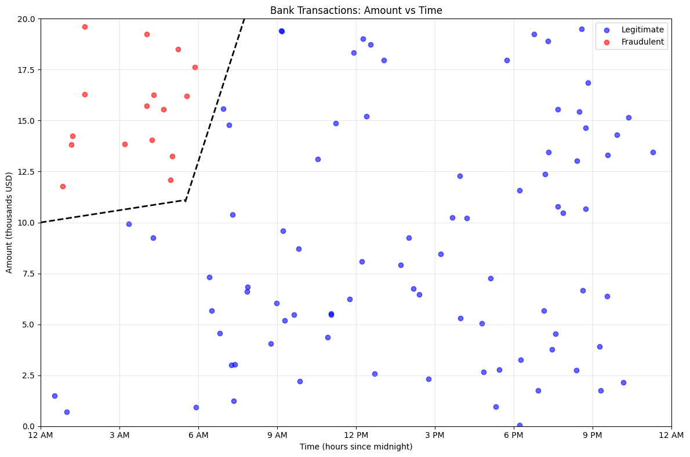
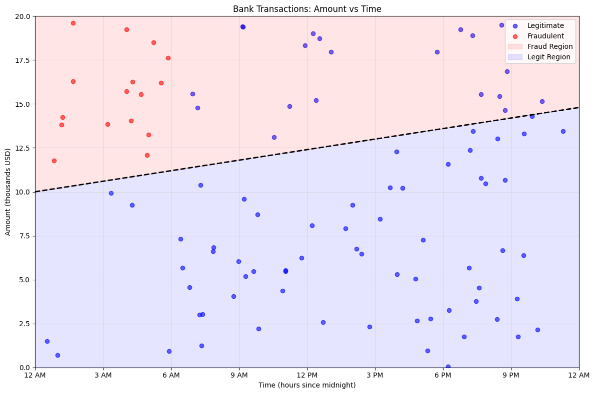
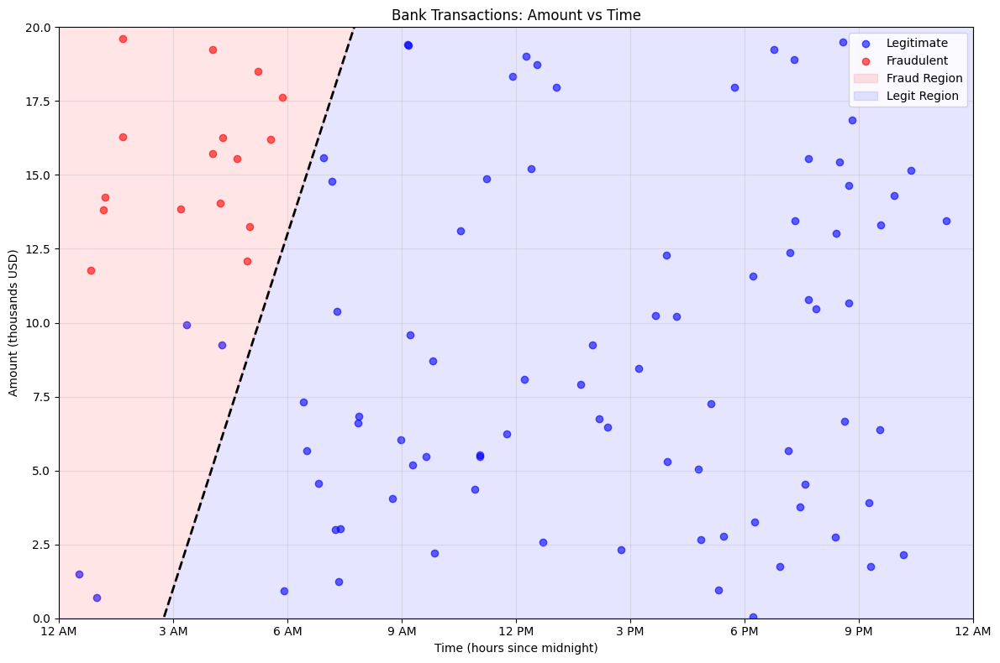
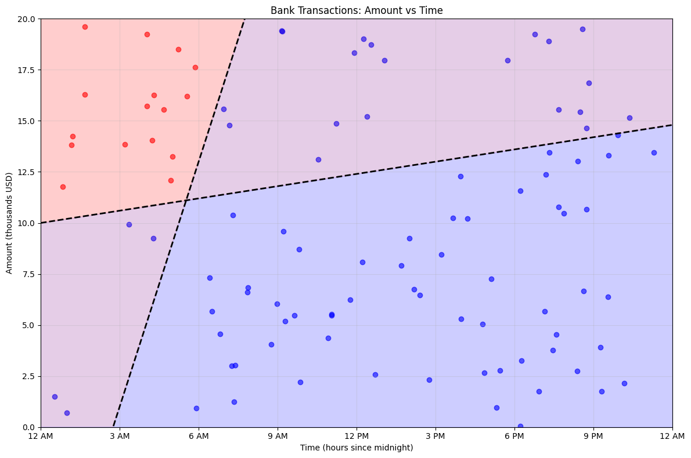
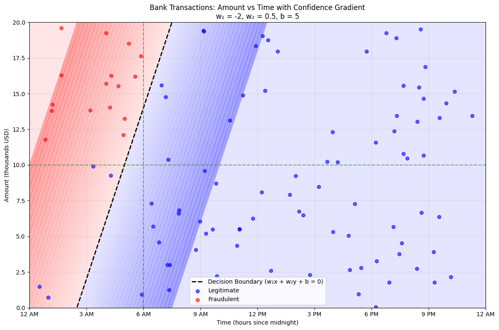

# Neural Networks

If you haven't read the previous part about the [perceptron](../1 - Perceptron/README.md) I'd recommend checking it out first.

## History

While the perceptron initally showed great promise, the limitations quickly became apparent. So much so that Marvin Minsky and Seymour Papert published the *Perceptrons* in 1969, giving multiple mathematical proofs as to what the big limitations of a perceptron are. This book led to the first AI winter, where the general consensus was that the potential of AI was not realized. However, this does not mean that research halted, but other research gathered more attention at the time. 

However, since we're discussing this here in this day and age, it is safe to assume that it turned out to be important after all.

## Overview
### Perceptron Recap

In the previous chapter we discussed the perceptron, which is one of the simplest forms of artificial neural networks. We defined it as having the following properties:
1. It's a **classifer**: it categorizes things to a group (walk/don't walk). 
2. It's **binary**: there are only two categories to assign to (walk/don't walk, fraudulent/legitimate).
3. It's **linear**: it makes its decision by drawing a straigt line between the two categories.

It was our first dive into the world of AI and found out that by providing training samples a model could learn to make a decision when given new input. Recall, this decision making, called **inference**, was done via the following steps:
1. Calculate the weighted sum using the inputs and the weights:

$\sum_{i} w_ix_i + b = w_1x_1 + w_2x_2 + \ldots + w_nx_n + b$

2. Apply the Heaviside step function to this weighted sum to get the final decision:

However, we quickly discovered some limitations:
1. Limited to predicting two classes
2. Not every decision can be made by drawing a line
3. Unable to assign importance to misclassifications

Let's now work step by step on how we can make adjustments to our small perceptron to transform it into a mighty **Neural Network**.

### The perceptrons are multiplying??
Let's come back to our fraud example. We remember that we use a straight line to separate our samples. But now what if instead of using one line to separate the data, we use multiple? It might look as Figure 1.

*Figure 1: Updated scatterplot for the fraud example to use two lines to better separate the classes*

This actually looks much better: using a crooked line we're able to completely separate the fraudulent and non-fraudulent transfers. This might look like a single crooked line, but you can continue these two lines and you get two straight lines, I simply left out a part for clarity. But this is a good discovery: we find that if we plot two lines and we combine them, we can create a line with one dent in it. But how can we create this? Let's reflect for a second. We know that the following is true:
1. The combination of two straight lines creates a line with one dent in it
2. A perceptron represents a single straight line

This makes us wonder: what if we connect multiple perceptrons to combine their straight lines and this way learn a crooked line? In essence, that's all there is to it: the **multi-layer perceptron**. Or more commonly, a **neural network**. Indeed, the simple perceptron we've been discussing the entire time is actually an **artificial neuron**, and by combining these neurons we can create a neural network!

Okay, we understand now that in some way we can combine these straight lines that come out from our neurons (yes, from now on I will use this instead of perceptron), but it's not yet clear in what way these should be combined. To get some feeling for this, consider Figure 2. 

*Figure 2: scatterplots showing our decision surfaces for two separate neurons*

These two images show the two separate lines fully drawn over our decision space, indicating what would we decide based on each neuron. Our left image mainly focuses on the amount of the transfer. If it is above a certain amount it will say it's fraudulent. Our right image on the other hand mainly focuses on the time of the transfer, and assumes a transfer is fraudulent when it is initiated early at night. This is something very common up until modern architectures, where certain neurons pay attention to a certain attribute! Note that it doesn't mean that the time does not impact the decision making for the first neuron, and vice versa. It just means that they are **primarely** looking at one characteristic.

But we notice that both these perceptrons would at best be equally bad or worse than the one we found in the previous part. So how will this lead us to better places? Let's consider by overlapping these two plots, Figure 3 shows this.

*Figure 3: scatterplots showing the decision surfaces for our combined neurons*

We identify three type of areas:
1. Red area: both neurons agree that the transfer looks suspicious and should be considered fraud
2. Blue area: both neurons agree that the transfer is safe
3. Purple area: the neurons are in disagreement, one neuron deems it safe while the other one thinks it's fraudulent
Let's show this in a table. First, we define the following encodings:

Expression | Encoding
--- | ---
Neuron 1 classifies a transfer as fraud | $y_{1,fraud} = 1$
Neuron 1 classifies a transfer as not fraud | $y_{1,fraud} = 0$
Neuron 2 classifies a transfer as fraud | $y_{2,fraud} = 1$
Neuron 1 classifies a transfer as not fraud | $y_{2,fraud} = 0$
A transfer is fraud | $y_{fraud} = 1$
A transfer is not fraud | $y_{fraud} = 0$

By looking at the data (which is a luxury that in reality is often not possible), we see that only the red area contains fraudulent transfers. We construct the following table:

Example | Time | Amount (USD) | 0-6AM? | >10k? | $y_{1,fraud} | $y_{2,fraud} | $y_{fraud}$
--- | --- | --- | --- | --- | --- | --- | ---
1 | 8 PM | 325 | No | No | 0 | 0 | 0
2 | 5 AM | 3,485 | Yes | No | 0 | 1 | 0
3 | 1 PM | 10,329 | No | Yes | No | 1 | 0 | 0
4 | 3 AM | 11,399 | Yes | Yes | Yes | 1 | 1 | 1

Hmm, these last three columns seem somewhat familiar...Remember our running example from previous chapter? We wanted to decide whether to go for a walk or not based on if the weather is good and whether you have free time. We said that if the weather is good that you'd always go for a walk. This translated to the following table:

Good Weather? | Free time? | $x_{weather}$ | $x_{time}$ | $y_{willingness}$ | $y_{walk}$
--- | --- | --- | --- | --- | ---
No | No | 0 | 0 | 0 | 0
No | Yes | 0 | 1 | 1 | 0
Yes | No | 1 | 0 | 1 | 0
Yes | Yes | 1 | 1 | 2 | 1

Compare columns $y_{1, fraud}$, $y_{2, fraud}$ and $y_{fraud}$ with $x_{weather}$, $x_{time}$ and $y_{walk}$: they're the exact same! Remember now that last chapter we made a perceptron that took in $x_{weather}$, $x_{time}$ and decided on $y_{walk}$. We can do the exact same thing here! We use a neuron that takes the output of neuron 1 and neuron 2 and combines it into one decision.

Let this sink in for a moment: simply by smartly combining 3 neurons, we were able to solve a problem that before was impossible!

Consider Figure 4, it shows a visualization of the architecture of our neural network.

TODO

*Figure 4: visual representation of the neural network*

The first layer from the left is called the **input layer**, since these represent the inputs. The first layer from the right is called the **output layer**, this neuron represents the final output of the network. The layer in between is called the **hidden layer**, since you don't directly interact with these layers. The values for these neurons and their weights is done during model training.

In this case, the neural network only has one hidden layer, but there can be as many hidden layers as you want. Adding extra layers increases the complexity the network can represent, but it costs a lot more time and resources to train. 

### Extending the perceptron
Let's first take a look at our running example from our previous chapter: we wanted to decide whether to go for a walk or not based on if the weather is good and whether you have free time. We said that if the weather is good that you'd always go for a walk. This translated to the following result:

Good Weather? | Free time? | $x_{weather}$ | $x_{time}$ | $y_{willingness}$ | $y_{walk}$ 
--- | --- | --- | --- | --- | ---
No | No | 0 | 0 | -2 ($= 0+0-2$) | 0
No | Yes | 0 | 1 | -1 ($= 0+1-2$) | 0 
Yes | No | 1 | 0 | 0 ($= 2+0-2$) | 1
Yes | Yes | 1 | 1 | 1 ($= 2+1-2$) | 1

Remember that we used the Heaviside step function to go from $y_{willingness}$ to $y_{walk}$. Now suppose that if the weather is good but you do not have time to go for a walk you might go only sometimes, let's say about 50% of the time. Also suppose that if the weather is good and you have free time you'd like to go for a walk 100% of the time. This info is not captured in $y_{walk}$. However, the attentive reader might've notices that this info is somewhat captured in $y_{willingness}$.

Let's also recall our fraud example: we said that a transfer was fraudulent if and only if was done late at night and if the amount transfered was very high. We noticed that no matter the line we drew, there were always misclassifications. What now if we could give an indication of how certain we are that a case is fraudulent. Here as well, the final weighted sum might reveal the answer. Consider Figure 1, it shows an updated scatterplot to take into the probability that a transaction is fraudulent.

*Figure 1: Updated scatterplot for the fraud example to show certainty*

Using this updated scatterplot we could for example say that transfers close to the line might be fraud, and that manual intervention is required, while the ones that are far away we are quite certain of our classification so no manual intervention required here.

The Heaviside step function is what we call the **activation function**: it decides whether the perceptron is activated ($output = 1$) or not ($output = 0$). Let's now introduce another, more commonly used activation function that can show **how much** it is activated: Rectified Linear Unit (or shorter, **ReLU**). We define the ReLU as follows:

Turns out it's actually quite simple! If we apply this activation function instead of the Heaviside step function we indeed get the following table for our simple example:

Good Weather? | Free time? | $x_{weather}$ | $x_{time}$ | $y_{willingness}$ | $y_{walk}$ 
--- | --- | --- | --- | --- | ---
No | No | 0 | 0 | -2 ($= 0+0-2$) | 0
No | Yes | 0 | 1 | -1 ($= 0+1-2$) | 0 
Yes | No | 1 | 0 | 0 ($= 2+0-2$) | 0
Yes | Yes | 1 | 1 | 1 ($= 2+1-2$) | 1

Oops, it alooks like we now make wrong decisions: we DO want to go for a walk sometimes when the weather is good, but the table shows that we wouldn't. Let's update our bias to reflect this: we change our bias from $b = -2$ to $b = -1$. We then get the following:

Good Weather? | Free time? | $x_{weather}$ | $x_{time}$ | $y_{willingness}$ | $y_{walk}$ 
--- | --- | --- | --- | --- | ---
No | No | 0 | 0 | -1 ($= 0+0-1$) | 0
No | Yes | 0 | 1 | 0 ($= 0+1-1$) | 0 
Yes | No | 1 | 0 | 1 ($= 2+0-1$) | 1
Yes | Yes | 1 | 1 | 2 ($= 2+1-1$) | 2

I've now made this adjustment myself, but when training our perceptron, it will be able to learn this adjustment as well. It shows that the decision of what type of activation fuction to use can influence the learned parameters.

However, one final thing is off in our table. Before, we said the following:

Expression | Encoding
--- | ---
You go for a walk | $y_{walk} = 1$
You do not go for a walk | $y_{walk} = 0$

However, this table makes no sense anymore with our previous results. Instead let's introduce now a new variable $p_{walk}$, that indicates the probability you go for a walk, with 1 being 100% and you definitely go, 0.5 is 50% and so on. From our definition from before, we want to get the following table:

Good Weather? | Free time? | $x_{weather}$ | $x_{time}$ | $y_{willingness}$ | $y_{walk}$ | $p_{walk}$
--- | --- | --- | --- | --- | --- | ---
No | No | 0 | 0 | -1 ($= 0+0-1$) | 0 | 0
No | Yes | 0 | 1 | 0 ($= 0+1-1$) | 0 | 0
Yes | No | 1 | 0 | 1 ($= 2+0-1$) | 1 | 0.5
Yes | Yes | 1 | 1 | 2 ($= 2+1-1$) | 2 | 1

So now how do we get from $y_{walk}$ to $p_{walk}$? Very simple: you get $p_{walk}$ by dividing $y_{walk}$ by two! What we did here is the process of **normalization**: we scale all the values to a number between 0 and 1. In this case normalization was very easy, but it can get slightly more complex: we discuss this in Technical Deepdive. 

The concept of normalization is a **very** important, so I recommend rereading this section if it's not entirely clear what just happened.

