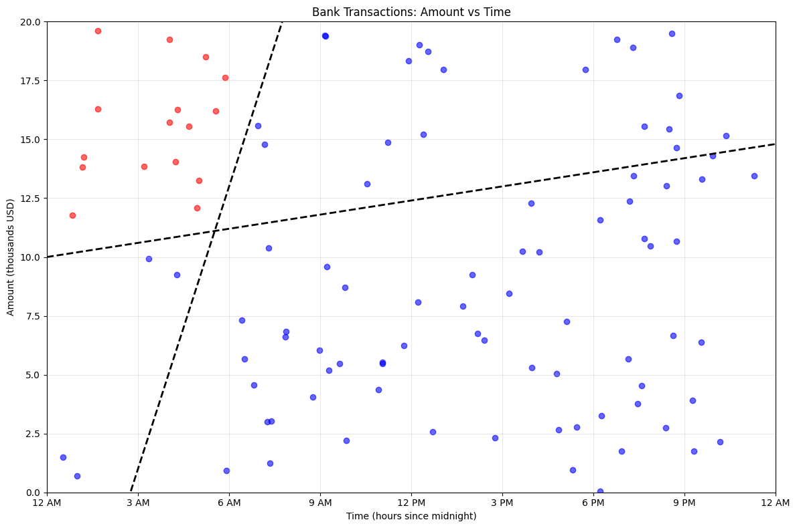

# Neural Networks

If you haven't read the previous part about the [perceptron](../1 - Perceptron/README.md) I'd recommend checking it out first.

## History

While the perceptron initally showed great promise, the limitations quickly became apparent. So much so that Marvin Minsky and Seymour Papert published *Perceptrons* in 1969, a book giving multiple mathematical proofs as to what the big limitations of a perceptron are. This book had very severe consequences, leading to the first AI winter, where the general public lost interest in AI and the consensus was that its potential was not realized. However, this does not mean that research halted, but other research gathered more attention at the time. 

However, it is safe to say that, since we're discussing this here in this day and age, it turned out to be much more important after all. But why did it turn out te be so essential after all, were Minsky and Papert wrong? As per usual, reality is much more nuanced.

## Overview
### Perceptron Recap

In the last chapter we discussed the perceptron, which is one of the simplest forms of artificial neural networks. We defined it as having the following properties:
1. It's a **classifer**: it categorizes things into a group (walk/don't walk). 
2. It's **binary**: there are only two categories to assign to (walk/don't walk, fraudulent/legitimate).
3. It's **linear**: it makes its decision by drawing a straigt line between two categories.

It was our first dive into the world of AI and found out that, by providing several training samples, a model could learn to make a decision when given newly, unseen input. Recall that, this decision making, called **inference**, was done via the following steps:
1. Calculate the weighted sum using the inputs and the weights:

$$
\sum_{i} w_ix_i + b = w_1x_1 + w_2x_2 + \ldots + w_nx_n + b
$$

2. Apply the Heaviside step function to this weighted sum to get the final decision:

While mathematically not complex, we were able to get a high *accuracy* on our very simple example of fraud classification. However, we quickly discovered some limitations:
1. Few decisions can be made by separating the decision space in two subspaces
2. The perceptron is limited to predicting two classes
3. We're unable to assign importance to misclassifications

Let's now work step by step on how we can make adjustments to our small perceptron to transform it into a mighty **Neural Network**, that will be able to much better handle these issues. Neural networks are very powerful, and there's a lot of content to cover but it is very important to have a thorough understanding of a lot of the concepts. Don't be discouraged if all is not clear immediately.

### The perceptrons are multiplying??
So where do we start? Let's start by taking back our fraud example from last chapter. We remember that we use a straight line to separate our samples and that we divided the decision space in two. But now what if instead of using only one singular line to separate the data, we're able to use multiple? This would give us more control of how we can divide the decision space. Where a singular line divides the area into two, two lines would allow us to split the area into four pieces. For example, it might look as in the figure below:

*Figure 1: Updated scatterplot that shows how two lines separates the area into four parts*

As we can see, these two lines can better separate the red from the blue dots. Let's now have our decision boundary decided, partly by our one line, and partly by the other line. This means that our decision boundary doesn't necessarily need to be straight anymore. Instead we can take the part where the two lines intersect as the transition point from our first line to our other line. Our decision boundary might then look like the following:

*Figure 2: Updated scatterplot for the fraud example to use two lines to better separate the classes*

This actually looks much better: using this crooked line, created by our two separate straight lines, we're able to completely separate the fraudulent and non-fraudulent transfers. This is a good discovery: we find that if we plot two lines and combine them, we can create a line with one dent in it, allowing us to create more complex decision boundaries. But how can we make an AI system learn this? Let's reflect for a second. We know that the following is true:
1. The combination of two straight lines creates a line with one dent in it
2. A perceptron represents a single straight line

This makes us wonder: what if we somehow connect multiple perceptrons to combine their straight lines and this way learn a crooked line? In essence, that's all the whole fuss is about: the **multi-layer perceptron**, or more commonly, a **neural network**. Indeed, the simple perceptron we've been discussing the entire time is actually an **artificial neuron**, and by combining these neurons we can create a neural network!

> NOTE: Up to this point we have used the word *perceptron* because it was the terminology used in the original experiments, but *neuron* is often used to refer to the exact same thing. Similarly, the multi-layer perceptron (or MLP) is often used interchangeably with neural networks. In actuality, a neural network is more broad, but for now we can assume they're the same.

Okay, we understand now that in some way we can combine these straight lines that come out from our neurons (yes, from now on I will use this instead of perceptron), but it's not yet clear in what way these should be combined. To get some feeling for this, consider Figure 2. 

*Figure 2: scatterplots showing our decision surfaces for two separate neurons*

These two images show the two separate lines fully drawn over our decision space, indicating what we would decide based on each neuron. Our first image mainly focuses on the amount of the transfer. If it is above a certain amount it will say it's fraudulent and low amounts will always be considered safe. Our second image on the other hand mainly focuses on the time of the transfer, and assumes a transfer is fraudulent when it is initiated early at night. Note that it does not mean that the first neuron does not take into account the time, and also not that the second one does not care about the amount. It just means that they are **primarely** looking at one characteristic.

Note that both these perceptrons, if used separately, would at best be equally bad or worse than the one we found in the previous part. So how will this lead us to greenes pastures? Let's consider by overlapping these two plots, Figure 3 shows this.

*Figure 3: scatterplots showing the decision surfaces for our combined neurons*

We identify three type of areas:
1. Red area: both neurons agree that the transfer looks suspicious and should be considered fraud
2. Blue area: both neurons agree that the transfer is safe
3. Purple area: the neurons are in disagreement, one neuron deems it safe while the other one thinks it's fraudulent
Let's show this in a table. First, we define the following encodings:

Expression | Encoding
--- | ---
Neuron 1 classifies a transfer as fraud | $y_{1,fraud} = 1$
Neuron 1 classifies a transfer as not fraud | $y_{1,fraud} = 0$
Neuron 2 classifies a transfer as fraud | $y_{2,fraud} = 1$
Neuron 1 classifies a transfer as not fraud | $y_{2,fraud} = 0$
A transfer is fraud | $y_{fraud} = 1$
A transfer is not fraud | $y_{fraud} = 0$

By looking at the data (which is a luxury that in reality is often not possible), we see that only the red area contains fraudulent transfers. We construct the following table:

Example | Time | Amount (USD) | 0-6AM? | >10k? | $y_{1,fraud} | $y_{2,fraud} | $y_{fraud}$
--- | --- | --- | --- | --- | --- | --- | ---
1 | 8 PM | 325 | No | No | 0 | 0 | 0
2 | 5 AM | 3,485 | Yes | No | 0 | 1 | 0
3 | 1 PM | 10,329 | No | Yes | No | 1 | 0 | 0
4 | 3 AM | 11,399 | Yes | Yes | Yes | 1 | 1 | 1

Hmm, these last three columns seem somewhat familiar...Remember our running example from previous chapter? We wanted to decide whether to go for a walk or not based on the weather and whether you have free time. We said that if the weather is good that you'd always go for a walk. This translated to the following table:

Good Weather? | Free time? | $x_{weather}$ | $x_{time}$ | $y_{willingness}$ | $y_{walk}$
--- | --- | --- | --- | --- | ---
No | No | 0 | 0 | 0 | 0
No | Yes | 0 | 1 | 1 | 0
Yes | No | 1 | 0 | 1 | 0
Yes | Yes | 1 | 1 | 2 | 1

Compare columns $y_{1, fraud}$, $y_{2, fraud}$ and $y_{fraud}$ with $x_{weather}$, $x_{time}$ and $y_{walk}$: they're exactly the same! Remember now that last chapter we made a perceptron that took in $x_{weather}$, $x_{time}$ and decided on $y_{walk}$. We can do the exact same thing here! We use a neuron that takes the output of neuron 1 and neuron 2 and combines it into our final decision.

Let this sink in for a moment: simply by combining three neurons in a smart way, we were able to solve a problem that before was impossible! If you're a more visually inclined person, take a look at the figure below, it visualizes the architecture of our neural network:

*Figure 4: visual representation of the neural network*

Now before we move on to **even** more interesting stuff, we have to introduce a bit of terminology:
1. **Input layer**: the first layer from the left. This layer represents the input(s) given to the neural network so it contains the same number of neurons as the number of inputs we have.
2. **Output layer**: the first layer from the right. This layer represents the output(s) calculated by the neural network. The number of neurons in this layer can actually be larger than one, but we'll get back to that.
3. **Hidden layer(s)**: the layer between the input and output layer. As opposed to the input- and output layer, which can only be one layer, the hidden layers can consist of multiple layers. If a neural network has multiple hidden layers, we call it a **deep neural network**. The hidden layer(s) learn some "hidden" representation of the data, i.e., one neuron learned that high transfer amount is important and one leuron learned that early during the night is important. In this case, the neural network only has one hidden layer, but there can be as many hidden layers as you want. Adding extra layers increases the complexity the network can represent, but it costs a lot more time and resources to train. Note that the number of neurons in this layer can be as large as we want! Usually, one does not know how many neurons or how many hidden layers are need to properly represent a dataset, so it is often a matter of trial and error.

### Visualization

Just like we did for the perceptron, let's visualize the training of the neural network: we will be able to see how the weights of our individual perceptrons evolve to decide on our two lines that will be used for inference.

TODO example

This is something very common up until modern architectures, where certain neurons pay attention to a certain attribute! 
Although both our neurons separately would perform worse, together they are more mighty then the perceptron from before. In other words, three neurons that individually perform worse, perform better once they are working together.

### Inference in a neural network

Using a neural network for inference is, knowing how a single neuron works, actually very straightforward. Remember how it was done for a perceptron:
1. The perceptron receives input values
2. It multiplies each input by its corresponding weight
3. It adds the bias
4. Finally, it uses the Heaviside step function to make a yes/no decision

Remember that a neural network are just connected neurons (or perceptrons), so to use a neural network for inference we simply have to use each neuron for inference. Suppose our neural network described before consisting of three layers:
1. Input layer with two neurons: amount of money in the transfer and the time of the transfer
2. Hidden layer with two neurons: hidden representations discovered by the neural network that are relevant for the decision making
3. Output layer with one neuron: indicates whether a transfer is fraudulent or not

Let's go over the inference progress layer by layer:
1. In the input layer each neuron represents one input variable. So the output of each neuron in this layer is simply the input value.
2. Each neuron in the hidden layer performs the following steps:
    - Neuron receives input values
    - It multiplies each input by its corresponding weight
    - It adds the bias
    - Finally, it uses the Heaviside step function to make a yes/no decision
The output of these two neurons will now be the input for the neuron in the output layer
3. Finally, the neuron in the output layer does... well, the exact same thing as the neurons in the hidden layer

So you see, using a neural network for inference really is just doing inference for a single neuron many times over. We also call this process **forward propagation**, since we propagate the inputs forward all the way through the network.

### Training a neural network

Now training a neural network would require quite some mathematical knowledge, so we will not dive deep into the exact workings or mathematical derivation in this section. However, I will cover it in the technical deepdive. In this section I will try to provide you with intuition to understand the idea behind **backward propagation** or **backpropagation**, considered one of the most influental and important algorithms of the 20th century. So what is backpropagation? To properly understand what's going on, let's take a step back to the training of our small, little perceptron.

Training a perceptron meant updating the weights and the bias such that the line it represents best classifies the samples it was trained on. Once again, a neural network tries to do the same: it updates the weights and biases of each neuron in the network. However, it is unfortunately not as straightforward as for the perceptron.

Let's now discuss where the name *backpropagation* comes from. Clearly, it strongly resembles forward propagation, that we discussed just before, and that is not a coincidence. Training a neural network on a training sample goes as follows:
1. Use forward propagation to calculate the output of the neural network, going from input layer to output layer
2. Use backward propagation to update the weights and biases of the neurons of the neural network, going from output layer to input layer

That's right, forward propagation means going through the network from left to right, from input to output, while backward propagation means going through the network from right to left, from output to input. So far so good, but what does it mean to go through the network from right to left? Well, as in our perceptron, we update our weights by comparing the output of the neuron and what it should be. Now, a training sample only gives us information regarding what the output value should be, given some input values, so we really only know what the output should be at our final neuron. So let's start there!

We can calculate the **error** at our final neuron by calculating the absolute value of the difference between our predictions:

$$
error = abs(y_{true} - y_{prediction})
$$

This means that $error = 1$ if our prediciton is wrong, and $error = 0$ if our prediction is correct. Let's now revisit what it means to train a model: before I said that training our model means that we update our weights and bias such that we classify as many training samples correctly as possible. This is true, however, we can also look at it as follows: by training a model we **minimize our error**. So that's what we do: we update our weights and bias in such a way that we minimize our error. The first weights and bias that we update are the ones in our final layer. However, these are not the only weights responsible for the result we get: the weights of all the neurons in all the layers have *some* contribution (albeit big or small) in our final decision. Consider like this: if one of our neurons wrongly decide whether the value is above 10k or not, then that means that our output neuron will have wrong information and will make a wrong decision. So indeed, we must update all the weights.

And this is where the term backpropagation comes from: we start at the output layer, updates the weights and go one layer back toward the beginning. Using these updated weights we calculate the error at this layer for each neuron and update these weights as well, and we once again go back a layer, all the way up to the input layer.

I understand if this might seem somewhat vague still, didn't I just we didn't know the error at this hidden layer? Well, this is where the mathematical deduction comes in: namely, using derivative calculus, we can calculate the error at previous layers, using the updates from the layers before. So we calculate an error, that we then propagate back to the beginning of the network to calculate how the weights and bias should be updated.

If you've gotten up to this point I want to sincerely congratulate you. You now understand the basics of neural networks, and this is not an easy feat. However, there's still a lot more to cover until we get to Large Language Models, and it will only get more interesting!
 
### Upgrading the neuron
In this setion we will further tinker on our neuron to make it even more powerful than it already is. For this, let's consider our context of last chapter again. Insteada of our neural network, we only have a single neuron now. Consider our running example from our previous chapter: we wanted to decide whether to go for a walk or not based on if the weather is good and whether you have free time. We said that if the weather is good that you'd always go for a walk. This translated to the following result:

Good Weather? | Free time? | $x_{weather}$ | $x_{time}$ | $y_{willingness}$ | $y_{walk}$ 
--- | --- | --- | --- | --- | ---
No | No | 0 | 0 | -2 ($= 0+0-2$) | 0
No | Yes | 0 | 1 | -1 ($= 0+1-2$) | 0 
Yes | No | 1 | 0 | 0 ($= 2+0-2$) | 1
Yes | Yes | 1 | 1 | 1 ($= 2+1-2$) | 1

Remember that we used the Heaviside step function to go from $y_{willingness}$ to $y_{walk}$. Now suppose that if the weather is good but you do not have time to go for a walk you might go only sometimes, let's say about 50% of the time. Also suppose that if the weather is good and you have free time you'd like to go for a walk 100% of the time. This info is not captured in $y_{walk}$. However, the attentive reader might've noticed that this info is somewhat captured in $y_{willingness}$.

Let's also recall our fraud example: we said that a transfer was fraudulent if and only if was done late at night and if the amount transfered was very high. We noticed that no matter the line we drew, there were always misclassifications. What now if we could give an indication of how certain we are that a case is fraudulent. Here as well, the final weighted sum might reveal some part of the answer. Consider Figure 1, it shows an updated scatterplot to take into the probability that a transaction is fraudulent.

*Figure 1: Updated scatterplot for the fraud example to show certainty*

Using this updated scatterplot we could for example say that transfers close to the line might be fraud, and that manual intervention is required, while the ones that are far away we are quite certain of our classification so no manual intervention required here.

The Heaviside step function is what we call the **activation function**: it decides whether the neuron is activated ($output = 1$) or not ($output = 0$). Let's now introduce another, more commonly used activation function that can show **how much** it is activated: Rectified Linear Unit (or shorter, **ReLU**). We define the ReLU as follows:

Turns out it's actually quite simple! If we apply this activation function instead of the Heaviside step function we indeed get the following table for our simple example:

Good Weather? | Free time? | $x_{weather}$ | $x_{time}$ | $y_{willingness}$ | $y_{walk}$ 
--- | --- | --- | --- | --- | ---
No | No | 0 | 0 | -2 ($= 0+0-2$) | 0
No | Yes | 0 | 1 | -1 ($= 0+1-2$) | 0 
Yes | No | 1 | 0 | 0 ($= 2+0-2$) | 0
Yes | Yes | 1 | 1 | 1 ($= 2+1-2$) | 1

Oops, it alooks like we now make wrong decisions: we DO want to go for a walk sometimes when the weather is good, but the table shows that we wouldn't. Let's update our bias to reflect this: we change our bias from $b = -2$ to $b = -1$. We then get the following:

Good Weather? | Free time? | $x_{weather}$ | $x_{time}$ | $y_{willingness}$ | $y_{walk}$ 
--- | --- | --- | --- | --- | ---
No | No | 0 | 0 | -1 ($= 0+0-1$) | 0
No | Yes | 0 | 1 | 0 ($= 0+1-1$) | 0 
Yes | No | 1 | 0 | 1 ($= 2+0-1$) | 1
Yes | Yes | 1 | 1 | 2 ($= 2+1-1$) | 2

I've now made this adjustment myself, but when training our neuron, it will be able to learn this adjustment as well. It shows that the decision of what type of activation fuction to use can influence the learned parameters.

However, one final thing is off in our table. Before, we said the following:

Expression | Encoding
--- | ---
You go for a walk | $y_{walk} = 1$
You do not go for a walk | $y_{walk} = 0$

However, this table makes no sense anymore with our previous results. Instead let's introduce now a new variable $p_{walk}$, that indicates the probability you go for a walk, with 1 being 100% and you definitely go, 0.5 is 50% and so on. From our definition from before, we want to get the following table:

Good Weather? | Free time? | $x_{weather}$ | $x_{time}$ | $y_{willingness}$ | $y_{walk}$ | $p_{walk}$
--- | --- | --- | --- | --- | --- | ---
No | No | 0 | 0 | -1 ($= 0+0-1$) | 0 | 0
No | Yes | 0 | 1 | 0 ($= 0+1-1$) | 0 | 0
Yes | No | 1 | 0 | 1 ($= 2+0-1$) | 1 | 0.5
Yes | Yes | 1 | 1 | 2 ($= 2+1-1$) | 2 | 1

So now how do we get from $y_{walk}$ to $p_{walk}$? Very simple: you get $p_{walk}$ by dividing $y_{walk}$ by two! What we did here is the process of **normalization**: we scale all the values to a number between 0 and 1. In this case normalization was very easy, but it can get slightly more complex: we discuss this in Technical Deepdive. 

The concept of normalization is **very** important, so I recommend rereading this section if it's not entirely clear what just happened.

### Making more than a binary decision
Notice that we've covered only binary decisions up until now: the answer is either yes or no. We take these types of decisions on the daily, however, most decisions we make are actually not as black and white. Oftentimes there are many possible answers to a questions, e.g., what do I want to eat today? What clothes do I want to wear today? Which chore do I do first? Indeed, it seems like limiting ourselves only to binary decisions strongly limits the impact we can make. Fortunately for us, it doesn't require a lot of change to what we already have!

Using our previously found knowledge about being able to represent probabilities actually can help us out. To illustrate, suppose the following situation
